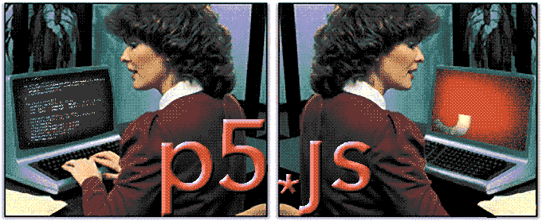

# Introduction to p5*js! 

This is a one-day introduction to the p5js web programming framework for javascript. It is suitable for students with little or no programming experience. p5js is an excellent gateway way to learning programming. In the class we will breifly cover some necessary basics of HTML and Javascript to get up and running, but will primarily focus on the p5js environment for animation and interactivity. By the end of this class you will create your own interactive web page, and will have the tools to continue exploring and learning p5js on your own.

* Why is it cool? 
	* have a look at one of the more than eleven-thousand examples on [Open Processing](https://www.openprocessing.org/browse#) 
	* an inspiring [talk by Casey Reas](https://vimeo.com/45851523) (one of the creators of Processing)
	* Here is a stupid game of [tictactoe](http://tictactoe.pink) that I made that works sometimes.
* Who should take it?
	* anyone interested in learning programming (is this too broad? – should I say you should have some familiarity with HTML? I want it to be accessible)
	* There will not be much math in this class, but it is expected that you have a working knowledge of Algebra or better, and a grasp of the [Cartesian Coordinate System](https://en.wikipedia.org/wiki/Cartesian_coordinate_system)
* What materials will students need?
	* You will need to bring your own laptop computer, and this should be equipped with the ability to join a WiFi network. NYC Resistor cannot provide extra laptops for this course. 

---

**Press onward to the [course syllabus...](Syllabus.md)**